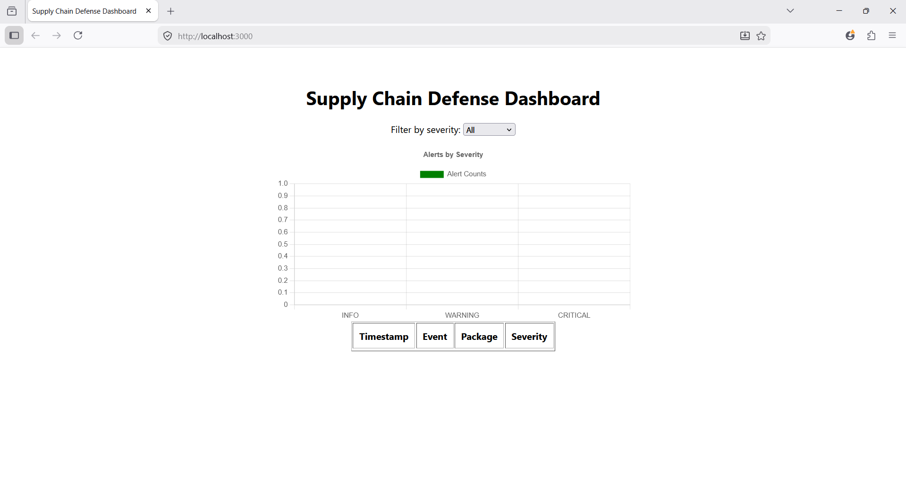

# Supply Chain Defense Dashboard

A React-based dashboard for monitoring container supply chain defense alerts.

## ✨ Features
- Real-time alerts from Node.js monitor service
- Severity color coding (INFO, WARNING, CRITICAL)
- Bar chart visualization of alert counts
- Filter alerts by severity
- Auto-refresh every 5 seconds

## ⚙️ Backend Setup
Run the monitor service:
```bash
docker compose up monitor

💻 Frontend Setup
cd supply-chain-dashboard
npm install
npm start

📊 Demo



🛠 Tech Stack
Node.js (backend monitor)

React (frontend dashboard)

Docker Compose (lab orchestration)

Chart.js (visualization)

👨‍💻 Author
Built by Abdul Hafoor A as part of a cybersecurity supply chain defense lab project.

